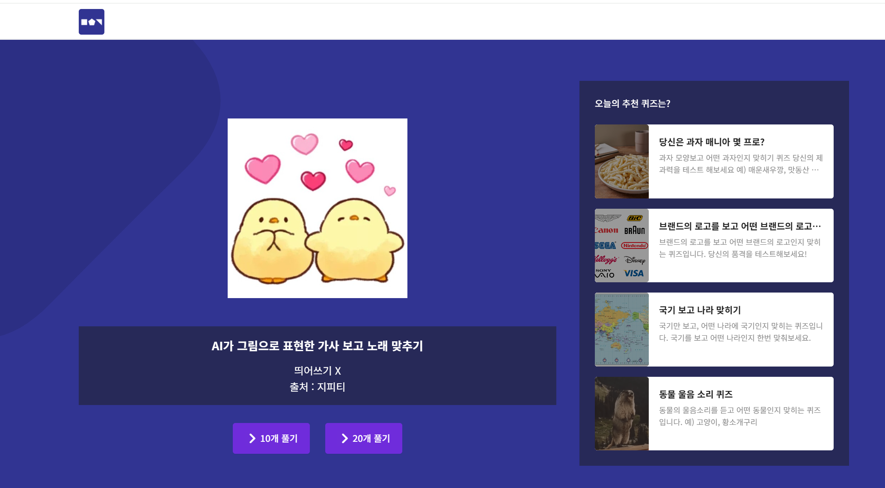

# TVSHOWGAME PROJECT
미디어에 나오는 여러가지 미니게임을 준비하고 즐길 수 있는 프로젝트

## 목적
예능이나 유튜브에서 보던 게임을 준비하거나 진행하기 위한 시간과 노력을 줄여주고자 한다.

## Target
위에서 말한 게임들을 준비하거나, 직접 플레이해보고 싶은 사람들

## 핵심 가치
시간 절약 : 비슷한 류의 미니게임을 준비하는데 시간 소모를 줄인다

이런 만들어진 영상들을 보는 것에서 끝나지 않고 직접 플레이하고자 하는 욕심을 채우는 것

## Pain Point

1. 시간적 여유
 

(https://www.youtube.com/watch?v=juIB9jyg0Bk)

위와 같은 게임들을 준비하기 위해서는 적어도 10개, 많게는 3~40번의 생성 작업이 필요하다. 본 프로젝트에서는 이러한 시간을 줄이는 것이 목표 중 하나이다.

2. 직접 플레이 해볼 기회가 적다

이런 류의 게임의 경우, 재현한 케이스가 이렇게 한정적인 환경에서 실행되어 한 두번 진행하다 보면 소스가 떨어져 진행하기 어려운 경우가 많디.

## Wow Point

1. 큰 문제의 풀

주기적으로 업데이트 하는 목록과 더불어 매번 달라지는 이미지들을 통해 같은 새로움을 줄 수 있음

2. 커스텀 가능성

연도, 가수, 혹은 직접 원하는 곡을 선택하여 문제를 구성할 수 있도록 한다면 흥미가 더 올라갈 것.

## 의심, 그리고 질문

1. 넓은 문제 풀

-> 문제를 얻어갈 수 있다면 자주 방문할 것
-> 매번 다른 문제를 가지고 플레이 할 수 있다면? 자주 접속할 것

2. 커스텀이 가능하다면?

-> 원하는 컨셉의 문제를 만들어서 관심사가 비슷한 커뮤니티에서 즐길거리가 될 수 있음

### 그러기 위해서는 우리는 어떤 전제를 하고 있나?

미디어에서 노출되는 미니게임 시청 후 직접 플레이하고 싶은 마음이 생길 것이다.
레크레이션이나 친목 행사에서 이러한 게임을 진행하고자 하는 마음이 생길 것이다.

### 그런데 진짜?

일단 나는 그런데, 그리고 이런 페이지가 알려지지 않거나(1) 퀄리티가 좋지 않다면(2) 굳이 접근할 이유는 없다.

## 어떻게 하면 할 수 있을까?

0. (사용자가 커스텀한 범위에서) 
1. 노래의 가사 일부분을 추출
2. 추출한 가사를 이미지 생성 프롬프트로 이용
3. 생성된 이미지 제공

- 생성된 이미지는 가사 쌍과 함께 데이터베이스에 저장하여 문제 풀로 활용
- 이후 데이터가 쌓인 이후에는 생성이 아니라 문제은행에서 뽑아오는 방향도 활용
- 사용자가 커스텀한 집합을 등록할 수 있는 형태로 운영하여 원하는 경우 선택하여 쓸 수 있도록 함
- (문제를 푸는 경우에, 사용자 정답-오답 비율을 활용해 난이도 feature 도입)
- (랭킹?)

## 검증하고 싶은 가설과 핵심 타겟, 핵심 기능

가설..? 미디어를 보고 따라하고 싶은 사람의 수는 많다. 

**핵심 타겟** : 미디어에 노출된 컨텐츠에 관심이 많은 자 / 친목 도모 주최자  

**핵심 기능** : AI 이미지 생성 및 저장 / 반복 작업 최소화 / 쉬운 UI를 통한 접근성 증대

## 사용자 여정 지도

